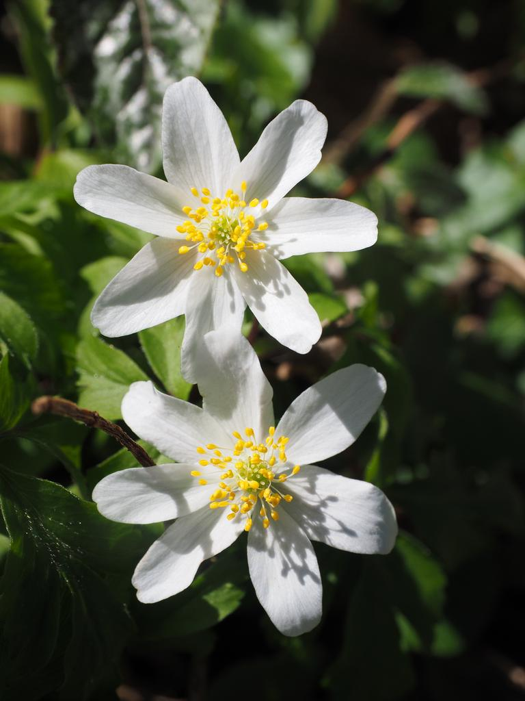

## {.section-slide}
<p/>
:::{.section-number}
1
:::
:::{.section-name}
Estudo de Caso
:::
:::{.section-subname}
sub-título
:::

## {background-image="flowers-many.jpeg"}
:::{.message-box}
As pessoas não temem a mudança, elas temem a incerteza.
:::
## {background-image="flowers-many.jpeg"}
:::{.message-box-accent}
As pessoas não temem a mudança, elas temem a incerteza.
:::
## {background-image="flowers-many.jpeg"}
:::{.message-box-dark}
As pessoas não temem a mudança, elas temem a incerteza.
:::

## Annotation Types

| Type | Description |
|------|-------------|
| `highlight` | Yellow marker highlight (default) |
| `underline` | Underline the text |
| `box` | Draw a box around the element |
| `circle` | Draw a circle around the element |
| `strike-through` | Strike through the text |
| `crossed-off` | Cross off with an X |
| `bracket` | Draw brackets around the element |

## Options

All options are prefixed with `rn-`:

| Option | Example | Description |
|--------|---------|-------------|
| `rn-type` | `rn-type=underline` | Annotation style |
| `rn-color` | `rn-color=blue` | Annotation color |
| `rn-animate` | `rn-animate=false` | Disable animation |
| `rn-animationDuration` | `rn-animationDuration=2000` | Animation duration in ms |
| `rn-strokeWidth` | `rn-strokeWidth=3` | Line thickness |
| `rn-padding` | `rn-padding=10` | Space around element |
| `rn-multiline` | `rn-multiline=true` | Annotate across multiple lines |
| `rn-iterations` | `rn-iterations=1` | Number of drawing passes |
| `rn-brackets` | `rn-brackets=left,right` | Bracket sides (for bracket type) |


## rn-type

Set the annotation style. Default is `highlight`.

::: columns
::: {.column width="50%"}
[Underline]{.rn-fragment rn-type=underline rn-color=red fragment-index=1}

[Box]{.rn-fragment rn-type=box rn-color=purple fragment-index=2}

[Circle]{.rn-fragment rn-type=circle rn-color=blue fragment-index=3}

[Highlight]{.rn-fragment rn-type=highlight fragment-index=4}

[Strike-Through]{.rn-fragment rn-type=strike-through rn-color=green fragment-index=5}

[Crossed-off]{.rn-fragment rn-type=crossed-off rn-color=orange fragment-index=6}

[Bracket]{.rn-fragment rn-type=bracket rn-color=teal fragment-index=7}
:::

::: {.column width="50%"}
::: {.rn-fragment rn-type=box rn-color=red fragment-index=8}
Div with `rn-type=box`
:::
:::
:::

## rn-color

Set the annotation color. Default is yellow highlight color.

[Blue]{.rn-fragment rn-color=blue fragment-index=1} | [Red]{.rn-fragment rn-color=red fragment-index=2} | [Green]{.rn-fragment rn-color=green fragment-index=3} | [Purple]{.rn-fragment rn-color=purple fragment-index=4}

<br>

::: {.rn-fragment rn-type=box rn-color=orange fragment-index=5}
Div with `rn-color=orange`
:::

## rn-color (formats)

Colors can be specified in multiple formats:

::: {style="font-size: 0.9em;"}
[Color name]{.rn-fragment rn-type=underline rn-color=tomato fragment-index=1} - `rn-color=tomato`

[Hex code]{.rn-fragment rn-type=underline rn-color=#3498db fragment-index=2} - `rn-color=#3498db`

[Hex with alpha]{.rn-fragment rn-type=highlight rn-color=#e74c3c80 fragment-index=3} - `rn-color=#e74c3c80` (50% opacity)

[RGB]{.rn-fragment rn-type=underline rn-color="rgb(46, 204, 113)" fragment-index=4} - `rn-color="rgb(46, 204, 113)"`

[RGBA]{.rn-fragment rn-type=highlight rn-color="rgba(155, 89, 182, 0.5)" fragment-index=5} - `rn-color="rgba(155, 89, 182, 0.5)"`
:::

## rn-animate

Disable animation with `rn-animate=false`. Default is `true`.

[With animation (default)]{.rn-fragment rn-type=underline rn-color=blue fragment-index=1}

[Without animation]{.rn-fragment rn-type=underline rn-color=red rn-animate=false fragment-index=2}

<br>

::: {.rn-fragment rn-type=box rn-color=green rn-animate=false fragment-index=3}
Div without animation
:::

## rn-animationDuration

Set animation duration in milliseconds. Default is `800`.

[Fast (200ms)]{.rn-fragment rn-type=underline rn-color=blue rn-animationDuration=200 fragment-index=1}

[Default (800ms)]{.rn-fragment rn-type=underline rn-color=green fragment-index=2}

[Slow (2000ms)]{.rn-fragment rn-type=underline rn-color=red rn-animationDuration=2000 fragment-index=3}

<br>

::: {.rn-fragment rn-type=box rn-color=purple rn-animationDuration=1500 fragment-index=4}
Div with 1500ms animation
:::

## rn-strokeWidth

Set line thickness. Default is `1`.

[Thin (1)]{.rn-fragment rn-type=underline rn-color=blue rn-strokeWidth=1 fragment-index=1}

[Medium (3)]{.rn-fragment rn-type=underline rn-color=green rn-strokeWidth=3 fragment-index=2}

[Thick (5)]{.rn-fragment rn-type=underline rn-color=red rn-strokeWidth=5 fragment-index=3}

<br>

::: {.rn-fragment rn-type=box rn-color=purple rn-strokeWidth=4 fragment-index=4}
Div with `rn-strokeWidth=4`
:::

## rn-padding

Set space around the element in pixels. Default is `5`.

[No padding (0)]{.rn-fragment rn-type=box rn-color=blue rn-padding=0 fragment-index=1}

[Default padding (5)]{.rn-fragment rn-type=box rn-color=green fragment-index=2}

[Large padding (20)]{.rn-fragment rn-type=box rn-color=red rn-padding=20 fragment-index=3}

<br>

::: {.rn-fragment rn-type=circle rn-color=purple rn-padding=15 fragment-index=4}
Div with `rn-padding=15`
:::

## rn-multiline

Enable annotations across multiple lines with `rn-multiline=true`.

Lorem ipsum dolor sit amet. [This span wraps across multiple lines to demonstrate the multiline option working correctly.]{.rn-fragment rn-multiline=true fragment-index=1} Consectetur adipiscing elit.

<br>

::: {.rn-fragment rn-type=box rn-color=purple rn-multiline=true fragment-index=2}
This div spans multiple lines and uses multiline mode for proper annotation rendering.
:::

## rn-iterations

Set the number of drawing passes. Default is `2`. Higher values create rougher look.

[One pass (1)]{.rn-fragment rn-type=underline rn-color=blue rn-iterations=1 fragment-index=1}

[Default (2)]{.rn-fragment rn-type=underline rn-color=green fragment-index=2}

[Many passes (5)]{.rn-fragment rn-type=underline rn-color=red rn-iterations=5 fragment-index=3}

<br>

::: {.rn-fragment rn-type=box rn-color=purple rn-iterations=4 fragment-index=4}
Div with `rn-iterations=4`
:::

## rn-brackets

For `rn-type=bracket`, specify which sides to draw. Options: `left`, `right`, `top`, `bottom`.

[Right bracket (default)]{.rn-fragment rn-type=bracket rn-color=blue fragment-index=1}

[Left bracket]{.rn-fragment rn-type=bracket rn-color=green rn-brackets=left fragment-index=2}

[Both sides]{.rn-fragment rn-type=bracket rn-color=red rn-brackets=left,right fragment-index=3}

<br>

::: {.rn-fragment rn-type=bracket rn-color=purple rn-brackets=top,bottom fragment-index=4}
Div with top and bottom brackets
:::

## rn-rtl

Draw annotation right-to-left with `rn-rtl=true`. Default is `false`.

[Left-to-right (default)]{.rn-fragment rn-type=underline rn-color=blue fragment-index=1}

[Right-to-left]{.rn-fragment rn-type=underline rn-color=red rn-rtl=true fragment-index=2}

<br>

::: {.rn-fragment rn-type=box rn-color=purple rn-rtl=true fragment-index=3}
Div with right-to-left animation
:::

## chat
::: {.chat}
::: {.bubble-right}
Hey, are you coming tonight?
:::

::: {.fragment .bubble-left}
Yeah! What time does it start?
:::

::: {.fragment .bubble-right}
Doors open at 7
:::
:::

## more...
::: {.chat}
::: {.bubble-right}
There are more things in heaven and earth, Horatio.
:::

[😮]{.fragment .reaction}
[👍]{.fragment .reaction}

::: {.fragment .bubble-left}
O day and night, but this is wondrous strange!
:::

[😂]{.fragment .reaction}
::: {.fragment .reaction}
😂
:::
:::

## reaction. 
::: {.chat}
::: {.bubble-right}
Message one
:::

[😮]{.fragment .reaction fragment-index="3"}

::: {.fragment .bubble-left fragment-index="1"}
Message two
:::

::: {.fragment .bubble-right fragment-index="2"}
Message three
:::
:::

## typing.  

::: {.chat}
::: {.bubble-right}
Are you still there?
:::

::: {.fragment .bubble-left .typing}
Sorry, was typing a really long reply.
:::
:::

## .image-right

::: columns
::: {.column width="45%"}
We can use the `.image-right` and `.image-left` classes to insert images in the background

These images will be placed behind most other content
:::
:::

{.image-right}

## .image-left {style="text-align: right;"}

::: columns
::: {.column width="55%"}
:::
::: {.column width="45%"}
It is therefore recommened that you use [multiple columns](https://quarto.org/docs/presentations/index.html#multiple-columns) to only have text on the background area
:::
:::

{.image-left}

## {background-image="flowers-many.jpeg" background-size="100px" background-repeat="repeat"}

::: r-fit-text
[background images]{style="color: hotpink;"}
:::

## Setting background colors {background-color="aquamarine"}

you can set your background as you normally would

## Slide Title {background-iframe="https://example.com"}

## Further Modifying theme

If you want to modify theme, you can specify the `.scss` my modifying the yaml to look like this

``` yaml
format: 
  letterbox-revealjs:
    theme: [default, style.scss]
```

## Modifying letterbox background

The background colors can be with with, where `#444444` represents the new background color and `#222222` represents the color of the shadow

``` css
.quarto-light {
  background-color: #444444;
}

.quarto-dark {
  background-color: #444444;
}

.slides {
  box-shadow: #222222 0px 0px 30px 0px;
}
```

## Quarto

Quarto enables you to weave together content and executable code into a finished presentation. To learn more about Quarto presentations see <https://quarto.org/docs/presentations/>.

## Bullets

When you click the **Render** button a document will be generated that includes:

-   Content authored with markdown
-   Output from executable code
    - teste
        - sub-sub
    - teste  

  

## Code

When you click the **Render** button a presentation will be generated that includes both content and the output of embedded code. You can embed code like this:

```{r}
1 + 1
```


## Ações de Gestão de Mudanças

### Selecione as 3 ações mais importantes da lista abaixo:

:::{.box-grid}
::: {.box}
1. Pedir ao CEO para enviar memorando a toda a empresa comunicando a mudança.
:::
::: {.box}
2. Mudar a disposição física - salas e mesas - dos envolvidos.
:::
::: {.box}
3. Desenhar um sistema de bonificação para premiar o engajamento.
:::
::: {.box}
4. Analisar quem perderá, e o que será perdido, com a nova solução.
:::
::: {.box}
5. Divulgar a causa e o contexto de negócio que levou a empresa a buscar a nova solução.
:::
::: {.box}
6. Replanejar as metas individuais de performance.
:::
::: {.box}
7. Distribuir um adesivo com logo do projeto e mensagem de comprometimento com a mudança.
:::
::: {.box}
8. Colocar os melhores recursos em uma equipe para que todos tenham ela como exemplo.
:::
::: {.box}
9. Conversar individualmente com membros da equipe para identificar desafios com a mudança.
:::
:::

## Tipos de Atividades
### Classifique as atividades do slide anterior conforme as seguintes categorias...
<p/>
:::{.box-row}
::: {.box}
A. Comunicação
:::
::: {.box}
B. Estrutura
:::
::: {.box}
C. Política
:::
::: {.box}
D. Gestão de Pessoas
:::
:::
:::{.box-row}
::: {.box}
.<p/>.<p/>.<p/>.<p/>.<p/>
:::
::: {.box}
.<p/>.<p/>.<p/>.<p/>.<p/>
:::
::: {.box}
.<p/>.<p/>.<p/>.<p/>.<p/>
:::
::: {.box}
.<p/>.<p/>.<p/>.<p/>.<p/>
:::
:::

